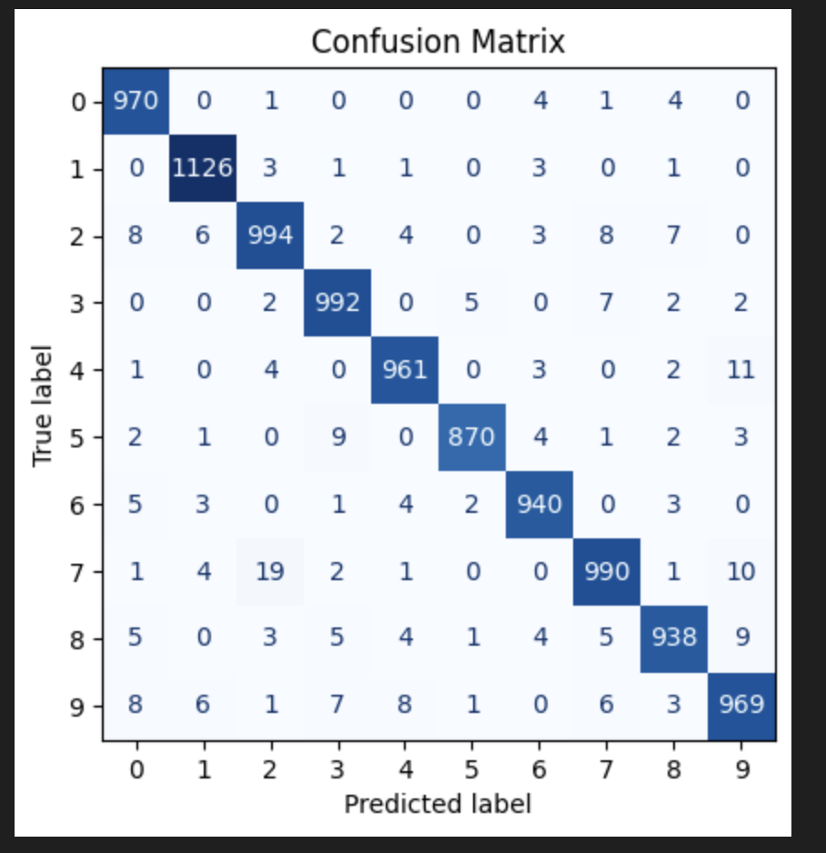

# Handwritten Digit Identification using Deep Learning (CNN)

This project demonstrates on how a simple Convolutional Neural Network model can be used to identify digits from images of handwritten digits.

Convolutional Neural Networks (CNNs) are a type of deep learning model specifically designed for processing structured grid data, such as images. They use convolutional layers to automatically and adaptively learn spatial hierarchies of features from input data. By applying filters to extract local patterns (e.g., edges, textures, or shapes). CNNs are highly effective for image recognition, object detection, and similar tasks (Goodfellow, 2016). Their architecture typically includes layers like convolutional, pooling, and fully connected layers, enabling feature extraction and decision-making.

### Datasets

The [MNIST database][1] of handwritten digits has a training set of 60,000 examples, and a test set of 10,000 examples.The MNIST handwritten digit classification problem is a standard dataset used in computer vision and deep learning as a benchmark to evaluate CNN model performances (Brownlee, 2021).

 This dataset is directly downloaded using `mnist.load_data()` method of `keras` package as shown in [notebook][2].

[1]:https://yann.lecun.com/exdb/mnist/
[2]: ./hand-written-digits-identification-deep-learning-cnn.ipynb

### Approach

Train a simple Convolutional Neural Network model with the `train` set to classify hand written digits images (0-9). Evaluate the performance of the model on the unseen `test` set of images based on Accuracy and Confusion matrix.

### Results

The model is performing well with a _test accuracy_ of $0.97$. Confusion Matrix shows high performance with very less number of incorrect classifications.

### References

Brownlee. J. (November 14, 2021). How to Develop a CNN for MNIST Handwritten Digit Classification. *Machine Learning Mastery*. **https://machinelearningmastery.com/how-to-develop-a-convolutional-neural-network-from-scratch-for-mnist-handwritten-digit-classification/**

Goodfellow, I., Bengio, Y., & Courville, A. (2016). *Deep learning.* MIT Press.
LeCun, Y., Bengio, Y., & Hinton, G. (2015). Deep learning. Nature, 521(7553), 436-444. **https://doi.org/10.1038/nature14539**
